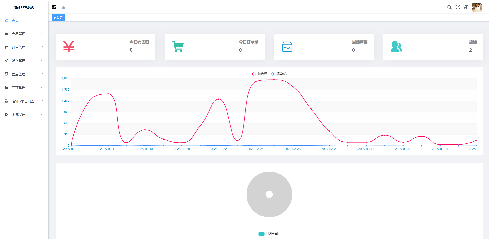
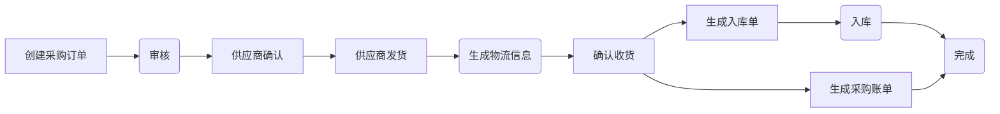
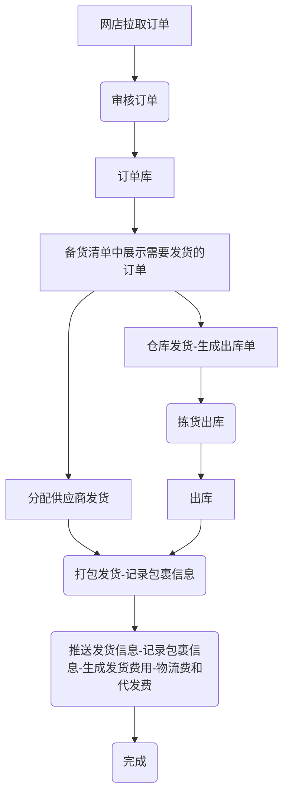
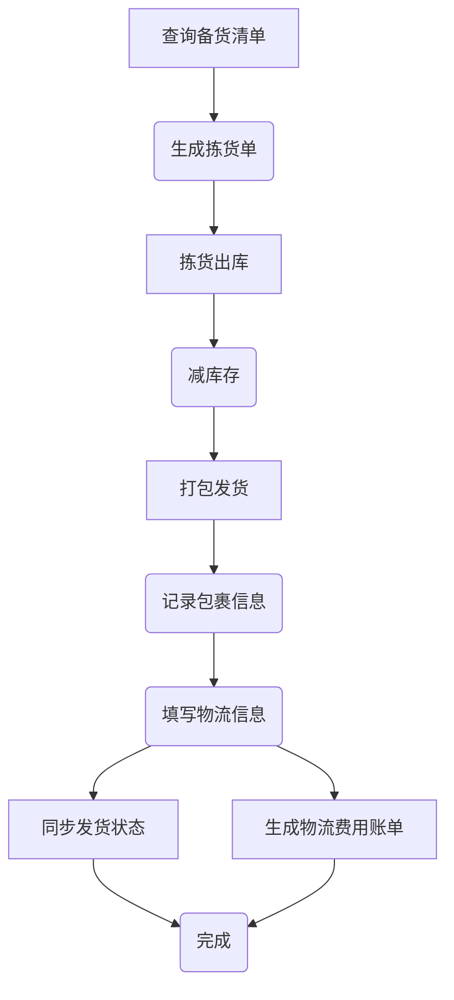
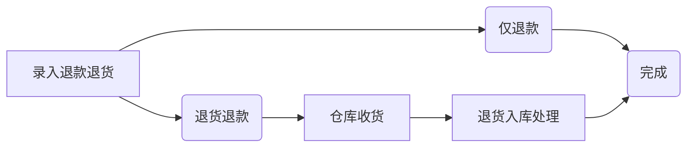
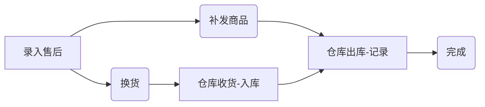
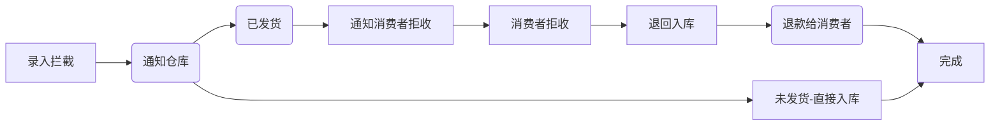

# 启航电商ERP系统2.0版
## 一、2.0系统介绍
启航电商ERP系统2.0版本是一个完整开箱即用的开源电商ERP系统，经历1.0版本的迭代优化和客户使用验证。开发者可以直接部署即可使用。

启航电商ERP系统是一个轻量级现代化的电商业务处理系统，该系统专注核心订单处理业务，去除了目前电商ERP系统中的大部分用不到的功能。与此同时该系统开放了核心API，以便开发者满足自己的个性化业务需求。

**2.0版本是一个开箱即用的版本，可以不用做任何代码修改即可使用在生产环境上。**

具体请看：[2.0版本与1.0版本的区别](https://mp.weixin.qq.com/s/jAsbYBsR7uDnj-FWSJBUwg)

## 二、系统特点
+ 1、启航电商ERP系统不是一个包罗万象的电商系统，它是一个专注核心业务处理并且又能快速方便扩展个性化需求的一个底座。

+ 2、启航电商ERP2.0版本是一个部署即可使用的开源电商ERP系统。

+ 3、该系统适合想自研电商系统的企业快速构建业务。**系统并不适合小卖家，小卖家还是老老实实使用市面上流行的SAAS吧。**

+ 4、使用启航电商ERP系统的前置条件是：**自行申请各电商开放平台的AppKey** [开放平台申请说明](https://mp.weixin.qq.com/s/KqyNlIVl43dTWicaAeLR1g)


## 三、功能模块

+ 商品管理：商品库管理、商品库SKU明细、商品分类管理（分类规格属性管理）、品牌管理、供应商管理。

+ 订单管理：多平台多店铺订单管理
  + 订单库：集合管理所有平台所有店铺订单。
  + 订单明细：以商品SKU为维度查询订单明细数据，主要用于核对商品销售数据。
  + 店铺订单管理：平台店铺原始订单数据，拉取平台店铺订单及管理，支持：**线下渠道、淘宝天猫、京东POP、京东自营、拼多多、抖店、微信小店**，后续计划支持更多平台。线下渠道订单支持手动添加。

+ 发货管理
  + 订单打印：订单电子面单打印，**支持平台：淘宝、京东、拼多多、抖店、微信小店**。
  + 备货清单：打印过的订单自动加入到备货清单中，备货清单支持打印备货单以便仓库件货，确认备货的商品会生成待出库单。
  + 发货记录：所有发货记录，类型包括：订单发货、订单补发、其他发货等，支持手动发货，订单备货完成发货会自动生成发货记录。
  + 发货快递管理：管理发货的快递公司信息。

+ 售后管理：
  + 售后中心：集合所有平台所有店铺的售后信息。并对售后进行处理，处理包括：订单拦截、订单补发、订单退货、订单换货、订单退款等
  + 店铺售后管理：线下渠道支持手动添加售后，网店售后采用API拉取，**支持平台：淘宝、京东、拼多多、抖店、微信小店**。
  + 售后处理记录：处理过的售后记录都在这里

+ 库存管理：仓库管理，仓库出入库明细管理。
  + 商品库存查询：查询商品库存详情，包括出入库明细和库存批次。
  + 采购入库管理：管理采购入库
  + 销售退货入库：管理订单售后退货入库
  + 采购退货出库：管理采购退货出库
  + 订单发货出库：备货清单中分配到仓库发货的待出库订单管理
  + 其他出库：包含：订单补发、售后处理、其他手动等出库管理
  + 仓库仓位管理

+ 采购管理：
  + 采购单管理：创建采购单、采购单审核
  + 采购物流管理
  + 采购入库管理：生成采购入库单，查询入库明细
  + 采购退货管理

+ 店铺管理：网店管理、网店参数设置、网店商品关联（**支持网店商品API拉取**）。

+ 任务设置及管理
  + 订单更新日志
  + 售后拉取日志
  + 定时任务配置

+ 系统设置：登录用户设置、系统设置等。





## 四、主要流程
**启航电商ERP可以说是我多年电商行业从业经验积累的成果。**

[听我吹牛请看](https://mp.weixin.qq.com/s/nPapuoQePVHHFm1hoJjSuw)


### 1 采购流程
+ 采购单管理：管理采购流程，包括供应商选择、采购单生成、采购单审核等。
+ 采购物流管理：跟踪采购订单物流信息。
+ 采购账单管理
+ 供应商管理：管理供应商信息


**采购流程**



### 2 发货流程


**订单发货流程**


**仓库发货流程**


### 3 售后处理流程

**退货退款流程**


**售后流程**



**订单拦截**



## 五、部署说明

#### 0 版本说明
+ Java：17
+ Nodejs：v16
+ SpringBoot:3
+ MySQL:8
+ Redis:7

#### 1 配置MySQL

+ 创建数据库`qihang-erp`
  + 1、导入数据库结构：sql脚本`docs\qihang-erp.sql`
  + 2、导入系统数据：sql脚本`docs\qihang-erp-sys.sql`

#### 2 启动Redis
项目开发采用Redis7

#### 3 修改项目配置

+ 修改`api`项目中的配置文件`application.yml`配置`Mysql`相关配置。


#### 4 mvn打包部署
+ Java版本：`Java 17`
+ Maven版本：`3.8`
  `mvn clean package`


#### 5 前端 `vue`打包
+ nodejs版本要求：`v16.x`
+ 安装依赖：`npm install --registry=https://registry.npmmirror.com`
+ 打包`npm run build:prod`

#### 6 修改Nginx配置

```
# 前端web配置
location / {
        #root   /opt/qihangerp/nginx/dist;
        root /usr/share/nginx/html;
        index  index.html index.htm;
        try_files $uri $uri/ /index.html;
    }
# 增加后台api转发
=======
##### 修改Nginx配置（增加vue404、增加后台api转发）

location /prod-api/ {
    proxy_set_header Host $http_host;
    proxy_set_header X-Real-IP $remote_addr;
    proxy_set_header REMOTE-HOST $remote_addr;
    proxy_set_header X-Forwarded-For $proxy_add_x_forwarded_for;
    proxy_pass http://localhost:8088/;
}
```
#### 7 访问web
+ 访问地址：`http://localhost`
+ 登录名：`admin`
+ 登录密码：`admin123`


## 六、支持一下

**感谢大家的关注与支持！希望利用本人从事电商10余年的经验帮助到大家提升工作效率！**

### 6.1 赠人玫瑰手留余香
💖 如果觉得有用记得点个 Star⭐


### 6.2 一起交流

💖 欢迎加入知识星期获得作者帮助和朋友们一起交流！

+ 交流QQ群：60235114

+ 知识星期
   


### 6.3 捐助作者
作者为兼职做开源,平时还需要工作,如果帮到了您可以请作者吃个盒饭


### 6.4 获取授权与服务

[如何获取授权与服务](https://mp.weixin.qq.com/s/mATn2nfc5bUePohS_s2WGw)

