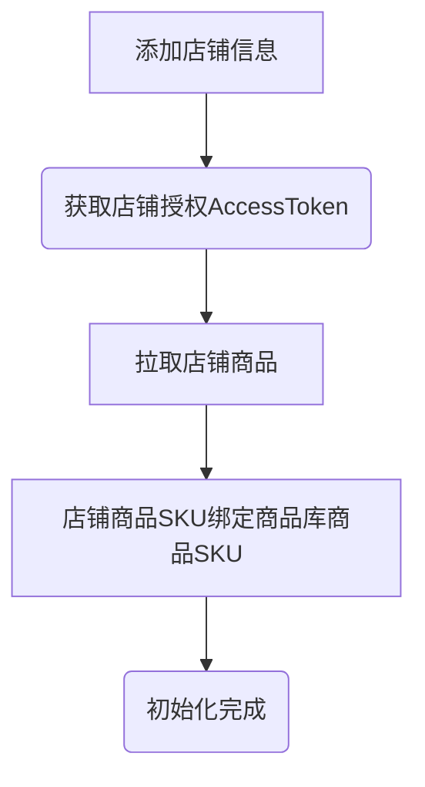
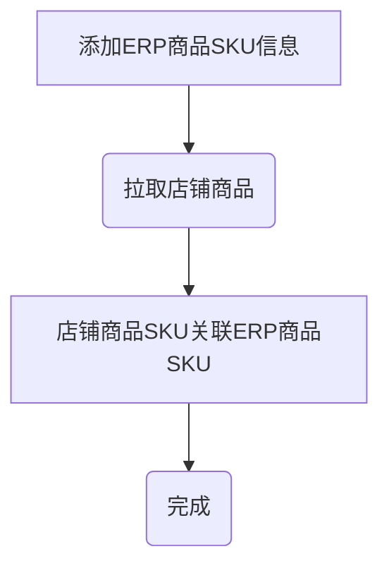
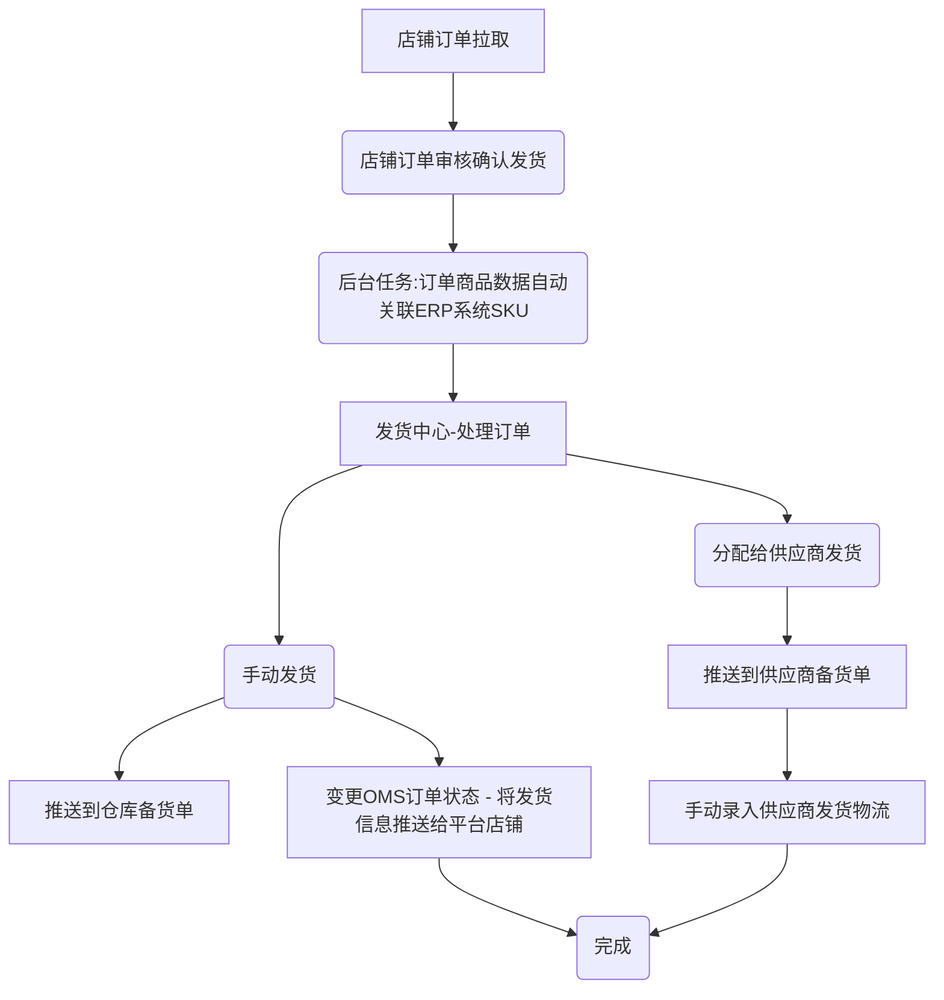
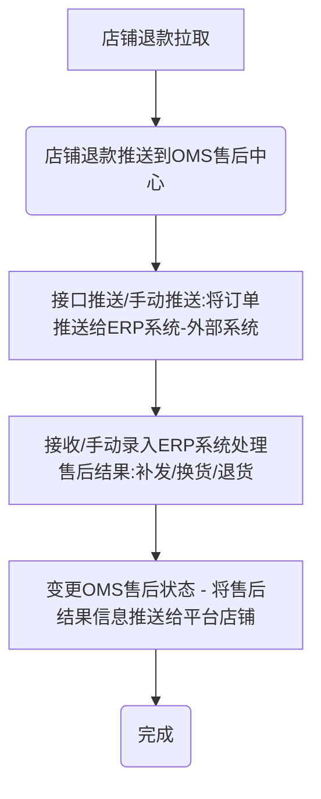

# 启航电商ERP系统2.0版

> **欢迎来到我们的开源项目！创新、协作、高质量的代码。您的Star🌟，是我们前进的动力！ 💪✨🏆**

> **项目持续更新中，还有很多不足，请多包含！如有任何疑问请提交issuse！谢谢！ 💪✨🏆**

## 一、系统介绍
启航电商ERP系统2.0版本是一个完整开箱即用的开源电商ERP系统，经历1.0版本的迭代优化和客户使用验证。开发者可以直接部署即可使用。

启航电商ERP系统逐步演变成了一个完整的ERP，主体功能包括：采购管理、商品管理、店铺商品管理、订单库、店铺订单管理、发货管理（手动发货、电子面单发货、供应商发货）、售后管理、库存管理等。

**商业版对接了外部云仓，可以直接将订单推送到云仓发货**

与此同时该系统会陆续增加供外部调用的API，以便开发者满足自己的个性化业务需求。

启航电商ERP系统支持：淘宝天猫、京东、拼多多、抖店、微信小店等平台，后续将继续对接其他电商平台。


#### 系统特点
+ 1、启航电商ERP系统是一个专注核心订单业务处理并且又能快速方便扩展个性化需求的一个底座。

+ 2、该系统适合想自研电商系统的企业快速构建业务。**系统并不适合小卖家，小卖家还是老老实实使用市面上流行的SAAS吧。**

+ 3、使用启航电商ERP系统的前置条件是：**自行申请各电商开放平台的AppKey** [开放平台申请说明](https://mp.weixin.qq.com/s/KqyNlIVl43dTWicaAeLR1g)


#### 主体功能

启航电商ERP系统支持多平台多店铺订单、售后、商品等管理，目前已接入：淘宝、京东、拼多多、抖店、微信小店，后续会继续接入快手小店、小红书等。

主体功能包括：
+ 商品库管理：商品库管理、分类&分类属性管理、供应商管理等。
+ 订单管理：店铺订单同步、管理。
+ 发货管理：电子面单打印、发货记录、物流跟踪等。
+ 售后管理：店铺售后同步、售后处理（补发、换货、退货处理）等。
+ 店铺&平台参数设置：店铺管理、店铺商品管理（拉取店铺商品、ERP关联）、店铺电子面单账户管理、平台参数设置。

**基本上覆盖了电商订单业务处理全流程，可使用接口对接内部ERP系统。**

**订单打单（电子面单打印）已支持：抖店、微信小店**

#### 系统架构

本项目后端采用`SpringCloudAlibaba`微服务架构开发。

前端采用`Vue2`+`ElementUI`开发

+ 后端技术及组件
  + Nacos 注册中心
  + Redis


## 二、关键流程
### 2.0 平台初始化流程


### 2.1 绑定商品库商品SKU



### 2.2 处理订单（发货）



### 2.3 处理售后



## 三、功能模块
#### 1、商品库
+ 商品库：管理商品库商品，提供手动录入、API接收功能，可以设置自己发货还是供应商发货（影响到后台分单逻辑，即时生效）。
+ 店铺商品：店铺商品管理，店铺商品API拉取、店铺商品API更新（进行店铺商品与商品库商品关联，根据SKU编码关联）。
+ 商品分类管理
+ 商品品牌管理

#### 2、采购管理
+ 采购订单管理
+ 采购入库管理
+ 采购承运商
+ 供应商管理


#### 3、订单管理
+ 发货订单库：审核发货的店铺订单。
+ 店铺订单管理：订单API拉取、订单API更新、审核发货等，支持淘宝天猫、京东、拼多多、抖店、微信小店。
+ 订单拉取日志：记录店铺订单每次拉取日志。，


#### 4、发货管理
+ 发货&分配发货：
  + 待发货：展示待发货和待分配发货的订单
  + 已发货：已经处理并发货的订单；
  + 已分配供应商发货：已经分配给供应商发货的订单；
+ 电子面单发货：支持快递打印、发货、补单等功能，开源版暂时不支持。
+ 备货单：已发货、已分配给供应商发货、电子面单打印快递单完成都会加入备货清单，提供给仓库备货查询。备货单可以生成出库单。
+ 发货记录：发货记录，提供手动发货功能。
+ 发货设置：设置发货快递、电子面单账户等信息
  + 快递公司管理：管理发货的快递公司（支持从平台拉取、支持手动添加）。
  + 电子面单账户设置：管理店铺开通的电子面单账户


#### 5、售后管理
+ 售后中心：聚合售后查询、详情、管理。
+ 店铺售后管理：售后API拉取、售后API更新、手动推送、售后操作（同意、备注）。
+ 售后处理记录：售后处理的记录查询，提供手动售后处理功能。
+ 售后拉取日志：店铺售后单拉取日志；


#### 6、库存管理
+ 商品库存管理：查询库存
+ 商品入库管理：支持手动入库
+ 商品出库管理：支持手动出库
+ 仓库仓位设置


#### 7、店铺&平台设置
+ 店铺管理
+ 平台开关


## 五、部署说明

#### 0 版本说明
+ Java：17
+ Nodejs：v16
+ SpringBoot:3
+ MySQL:8
+ Redis:7

#### 1 配置MySQL

+ 创建数据库`qihang-erp`
+ 导入数据库结构：sql脚本`docs\qihang-erp.sql`


#### 2 启动Redis
项目开发采用Redis7

#### 3 修改项目配置

+ 修改`app`项目中的配置文件`application.yml`配置`Mysql`相关配置。


#### 4 mvn打包部署
+ Java版本：`Java 17`
+ Maven版本：`3.8`
  `mvn clean package`


#### 5 前端 `vue`打包
+ nodejs版本要求：`v16.x`
+ 安装依赖：`npm install --registry=https://registry.npmmirror.com`
+ 打包`npm run build:prod`

#### 6 修改Nginx配置

```
# 前端web配置
location / {
        #root   /opt/qihangerp/nginx/dist;
        root /usr/share/nginx/html;
        index  index.html index.htm;
        try_files $uri $uri/ /index.html;
    }
# 增加后台api转发
=======
##### 修改Nginx配置（增加vue404、增加后台api转发）

location /prod-api/ {
    proxy_set_header Host $http_host;
    proxy_set_header X-Real-IP $remote_addr;
    proxy_set_header REMOTE-HOST $remote_addr;
    proxy_set_header X-Forwarded-For $proxy_add_x_forwarded_for;
    proxy_pass http://localhost:8088/;
}
```
#### 7 访问web
+ 访问地址：`http://localhost`
+ 登录名：`admin`
+ 登录密码：`admin123`


## 六、支持一下

**感谢大家的关注与支持！希望利用本人从事电商10余年的经验帮助到大家提升工作效率！**

### 6.1 赠人玫瑰手留余香
💖 如果觉得有用记得点个 Star⭐

### 6.2 一起交流

💖 欢迎一起交流！

+ 微信公众号

   


### 6.3 捐助作者
作者为兼职做开源,平时还需要工作,如果帮到了您可以请作者吃个盒饭


### 6.4 获取授权与服务

[如何获取授权与服务](https://mp.weixin.qq.com/s/mATn2nfc5bUePohS_s2WGw)

