# 启航电商ERP系统2.0版
> **欢迎来到我们的开源项目！创新、协作、高质量的代码。您的Star🌟，是我们前进的动力！ 💪✨🏆**

> **项目持续更新中，还有很多不足，请多包含！如有任何疑问请提交issuse！谢谢！ 💪✨🏆**

## 一、系统介绍
启航电商ERP系统2.0版本是一个完整开箱即用的开源电商ERP系统，经历1.0版本的迭代优化和客户使用验证。开发者可以直接部署即可使用。

启航电商ERP系统是一个专注核心订单处理业务，主体功能包括：商品管理、店铺商品管理、订单库、店铺订单管理、发货管理（支持多供应商发货）、售后管理、库存管理等。

与此同时该系统会陆续增加供外部调用的API，以便开发者满足自己的个性化业务需求。

启航电商ERP系统支持：淘宝天猫、京东、拼多多、抖店、微信小店等平台，后续将继续对接其他电商平台。


## 二、系统特点
+ 1、启航电商ERP系统是一个专注核心业务处理并且又能快速方便扩展个性化需求的一个底座。

+ 2、启航电商ERP2.0版本是一个部署即可使用的开源电商ERP系统。

+ 3、该系统适合想自研电商系统的企业快速构建业务。**系统并不适合小卖家，小卖家还是老老实实使用市面上流行的SAAS吧。**

+ 4、使用启航电商ERP系统的前置条件是：**自行申请各电商开放平台的AppKey** [开放平台申请说明](https://mp.weixin.qq.com/s/KqyNlIVl43dTWicaAeLR1g)


## 三、功能模块
#### 1、商品管理
+ 商品库管理：管理商品库商品，提供手动录入、API接收功能，可以设置自己发货还是供应商发货（影响到后台分单逻辑，即时生效）。
+ 商品库SKU明细：查看所有商品库SKU
+ 店铺商品管理：店铺商品管理，店铺商品API拉取、店铺商品API更新（进行店铺商品与商品库商品关联，根据SKU编码关联）。
+ 商品分类管理
+ 商品品牌管理
+ 供应商管理

#### 2、订单管理
+ 订单库：聚合订单查询、详情、管理。
+ 订单明细：聚合订单明细查询。
+ 店铺订单管理：订单API拉取、订单API更新、订单手动推送等，支持淘宝天猫、京东、拼多多、抖店、微信视频号。


#### 3、发货管理
+ 待发货清单：（商品维度、订单维度），展示待分配发货的清单（系统会根据商品设置的自己发货还是供应商发货自动分配到发货订单库）
+ 取号发货：电子面单取号发货
+ 订单打印：电子面单打印，支持淘宝天猫、京东、拼多多、抖店、微信视频号。
+ 备货出库：电子面单取号之后会加入备货清单，提供给仓库备货查询。发货之后会从备货清单中移除。
+ 发货记录：发货记录，提供手动发货功能。
+ 物流跟踪：提供发货物流查询。
+ 快递快递管理：管理发货的快递公司（支持从平台拉取、支持线下渠道手动添加发货快递）。
+ 面单账户管理：管理店铺开通的电子面单账户

#### 4、售后管理
+ 售后中新：聚合售后查询、详情、管理。
+ 店铺售后管理：售后API拉取、售后API更新、手动推送、售后操作（同意、备注）。
+ 售后处理记录：售后处理的记录查询，提供手动售后处理功能。


#### 5、库存管理
+ 商品库存管理：查询库存
+ 商品入库管理：支持手动入库
+ 商品出库管理：支持手动出库
+ 仓库仓位设置

#### 6、店铺&平台设置
+ 店铺管理
+ 平台设置
+ 订单更新日志：查询更新日志，主动排错。
+ 售后更新日志：查询更新日志，主动排错。
+ 定时任务配置


## 四、主要流程
**启航电商ERP可以说是我多年电商行业从业经验积累的成果。**

[听我吹牛请看](https://mp.weixin.qq.com/s/nPapuoQePVHHFm1hoJjSuw)


### 1 发货流程


**订单发货流程**

```mermaid
graph TD
A[网店拉取订单] -->B(审核订单)
    B --> C[订单库]
    C --> C1[备货清单中展示需要发货的订单]
    C1 --> D[仓库发货-生成出库单]
    C1 --> E[分配供应商发货]
    D --> F(拣货出库)
    F --> F1[出库]
    E --> H(打包发货-记录包裹信息)
    F1 --> H
    H --> G(推送发货信息-记录包裹信息-生成发货费用-物流费和代发费)
    G --> I(完成)
```


**仓库发货流程**

```mermaid
graph TD
A[查询备货清单] -->B(生成拣货单)
    B --> C[拣货出库]
    C --> E(减库存)
    E --> F[打包发货]
    F --> F1(记录包裹信息)
    F1 --> G(填写物流信息)
    G --> G1[同步发货状态]
    G1 --> H(完成)
    G --> G2[生成物流费用账单]
    G2 --> H

```


### 2 售后处理流程

**退货退款流程**

```mermaid
graph LR
A[录入退款退货] -->B(仅退款)
    B --> H(完成)
    A --> D(退货退款)
    D --> E[仓库收货]
    E --> F[退货入库处理]
    F --> H
```


**售后流程**

```mermaid
graph LR
A[录入售后] -->B(补发商品)
    B --> H[仓库出库-记录]
    A --> D(换货)
    D --> E[仓库收货-入库]
    E --> H
    H --> F(完成)
```



**订单拦截**


## 五、部署说明

#### 0 版本说明
+ Java：17
+ Nodejs：v16
+ SpringBoot:3
+ MySQL:8
+ Redis:7

#### 1 配置MySQL

+ 创建数据库`qihang-oms`
+ 导入数据库结构：sql脚本`docs\qihang-oms.sql`
+ 导入初始化数据：sql脚本`docs\qihang-oms-data.sql`


#### 2 启动Redis
项目开发采用Redis7

#### 3 修改项目配置

+ 修改`app`项目中的配置文件`application.yml`配置`Mysql`相关配置。


#### 4 mvn打包部署
+ Java版本：`Java 17`
+ Maven版本：`3.8`
  `mvn clean package`


#### 5 前端 `vue`打包
+ nodejs版本要求：`v16.x`
+ 安装依赖：`npm install --registry=https://registry.npmmirror.com`
+ 打包`npm run build:prod`

#### 6 修改Nginx配置

```
# 前端web配置
location / {
        #root   /opt/qihangerp/nginx/dist;
        root /usr/share/nginx/html;
        index  index.html index.htm;
        try_files $uri $uri/ /index.html;
    }
# 增加后台api转发
=======
##### 修改Nginx配置（增加vue404、增加后台api转发）

location /prod-api/ {
    proxy_set_header Host $http_host;
    proxy_set_header X-Real-IP $remote_addr;
    proxy_set_header REMOTE-HOST $remote_addr;
    proxy_set_header X-Forwarded-For $proxy_add_x_forwarded_for;
    proxy_pass http://localhost:8088/;
}
```
#### 7 访问web
+ 访问地址：`http://localhost`
+ 登录名：`admin`
+ 登录密码：`admin123`


## 六、支持一下

**感谢大家的关注与支持！希望利用本人从事电商10余年的经验帮助到大家提升工作效率！**

### 6.1 赠人玫瑰手留余香
💖 如果觉得有用记得点个 Star⭐


### 6.2 一起交流

💖 欢迎一起交流！

+ 微信公众号

   


### 6.3 捐助作者
作者为兼职做开源,平时还需要工作,如果帮到了您可以请作者吃个盒饭


### 6.4 获取授权与服务

[如何获取授权与服务](https://mp.weixin.qq.com/s/mATn2nfc5bUePohS_s2WGw)

